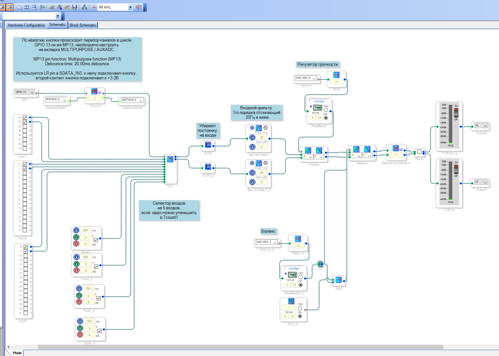

*Примеры проектов на adau1452.*

**Использовались:**
* [RDC3-0027v1, SigmaDSP ADAU1452. Модуль цифровой обработки звука. V1](https://www.chipdip.ru/product/rdc3-0027v1)
* [USB I2S преобразователь 32bit/96kHz, SUPER PRIME chipdip, USB Hi-Res Audio, квадро, STM32F446RC](https://www.chipdip.ru/product0/9000569733)
* [PCM5102A audio DAC, Преобразователь: I2S - Аудио. Разрешение 32 бит, частота дискретизации 384kHz](https://www.chipdip.ru/product/pcm5102a-audio-dac)
* [PCM1808 audio ADC, Преобразователь: Аудио - I2S. Разрешение 24 бит, частота дискретизации 96kHz](https://www.chipdip.ru/product/pcm1808-audio-adc)
* [SigmaLink-USBi, USBi программатор для SigmaStudio](https://www.chipdip.ru/product/sigmalink-usbi)
* [Ванилин, Программируемый контроллер на базе ATmega328P-AU, CP2102 (Arduino Uno)](https://www.chipdip.ru/product/vanilin-2)
* [RDC2-0015A, Преобразователь уровней напряжения. 4 в 1.](https://www.chipdip.ru/product/rdc2-0015a)

## 3. Версия с микроконтроллером Arduino. Демонстация отправки команды mute в DPS ADAU1452 при помощи Arduino

Проект SigmaDSP такй де как N2
Входы: USB через SUPER PRIME, китайский bluetooth 5.0 модуль подключенный через PCM1808 к ADAU1452, возможно использовать оставшиеся ОДИН вход и SPDIF. Селектор на пять каналов.
Два последних канала - тестовых.
Один вход занят кнопкой в режиме GPIO. Контакт LRCLK_IN3 / MP13.
Выходы: один PCM5102A серео.

**Схема:**
DSP подключен по I2C к Arduino к SDA (A4) и SLC (A5) по адресу 0x38, подключение через двунаправленный перобразователь уровня для 5в - 3.3в
К D2 подключена кнопка, которая включает/отключает Mute
К Arduino так же по I2C подключен двухстрочный дисплей по адресу 0x270x27

Команду для вкл/выкл mute - забираем из SigmaStudio в логах.

**Основная схема**

