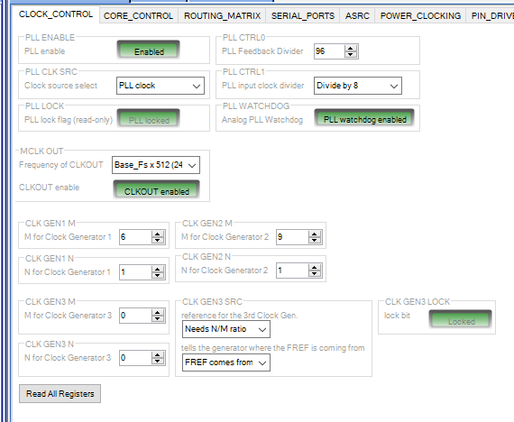
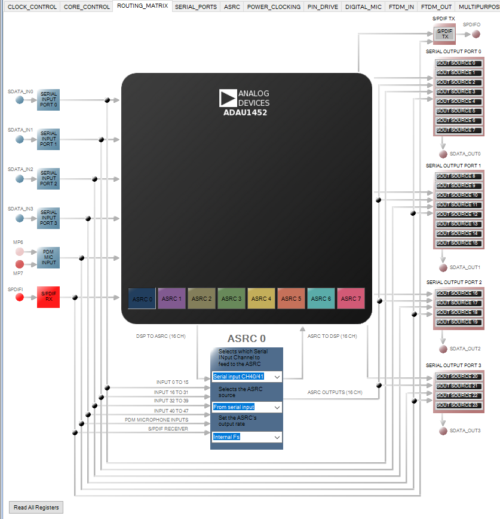
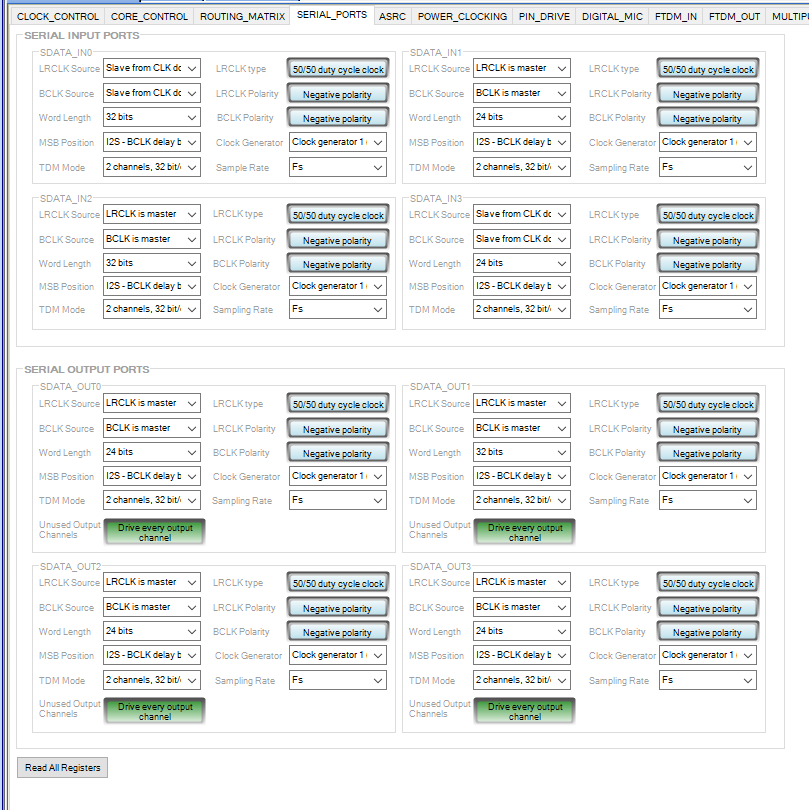
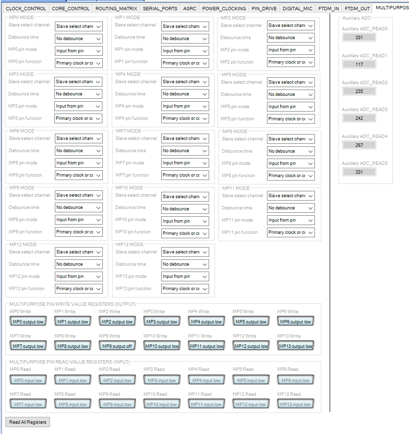

# dsp-adau1452
# Russian

*Примеры проектов на adau1452.*

**Использовались:**
* [RDC3-0027v1, SigmaDSP ADAU1452. Модуль цифровой обработки звука. V1](https://www.chipdip.ru/product/rdc3-0027v1)
* [USB I2S преобразователь 32bit/96kHz, SUPER PRIME chipdip, USB Hi-Res Audio, квадро, STM32F446RC](https://www.chipdip.ru/product0/9000569733)
* [PCM5102A audio DAC, Преобразователь: I2S - Аудио. Разрешение 32 бит, частота дискретизации 384kHz](https://www.chipdip.ru/product/pcm5102a-audio-dac)
* [PCM1808 audio ADC, Преобразователь: Аудио - I2S. Разрешение 24 бит, частота дискретизации 96kHz](https://www.chipdip.ru/product/pcm1808-audio-adc)
* [SigmaLink-USBi, USBi программатор для SigmaStudio](https://www.chipdip.ru/product/sigmalink-usbi)
* [Ванилин, Программируемый контроллер на базе ATmega328P-AU, CP2102 (Arduino Uno)](https://www.chipdip.ru/product/vanilin-2)
* [RDC2-0015A, Преобразователь уровней напряжения. 4 в 1.](https://www.chipdip.ru/product/rdc2-0015a)
* Энкодер
* Два ёмкосных датчика-кнопки
* Синий светодиод + резитор 220 Ом
* Красный светодиод + резистор 220 Ом
* Фоторезистор + 10кОм резистор, включено: одна нога фоторезистора на +5в, вторая нога фоторезистора соединяется с резистором и подключается к A0 Arduino, вторая нога рещистора подключается к GND.
* LCD экран 16х2 подклюаемый по I2C

## 4. Версия с микроконтроллером Arduino.

Входы: USB через SUPER PRIME, китайский bluetooth 5.0 модуль подключенный через I2S к ADAU1452, линейный вход, подключенный через PCM1808 к ADAU1452, SPDIF оптика через RX147, FM в проекте.
Выходы: один PCM5102A серео, два PCM5102A для XLR стерео выхода, дополнительно к каждому PCM5102A в месте подключения +5в и GND подключены конденсаторы 100мкФ и 0.1мкФ, иначе слышимые помехи, при включении лишь одного DAC ничего не нужно.

У входа стоят фильтры от постоянки на входе и фильтры высоких частот от 20Гц, чтобы обрезать всё что ниже.
Управления:
1 кнопка выклю/выкл - система засыпает
2 кнопка выбора каналов: последовательно BT -> USB -> LineIn -> FM -> SPDIF
3 Энкодер: клик - выбор параметра для регулировки, вращение - смена регулировки.
  Параметры:
  * громкость
  * баланс
  * включение супер басс
  * включение динамический басс
  * включение расширения стереобазы
После простоя работы с меню - преключение на громкость.

**Основная схема**

**Подключение блоков**

**Настройка DSP EEPROM**

**Вкладка настройки CLOCK CONTROL**

**Вкладка настройки asrc0**

**Вкладка настройки asrc1**

**Вкладка настройки SERIAL PORT**

**Вкладка настройки для настройка портов**

