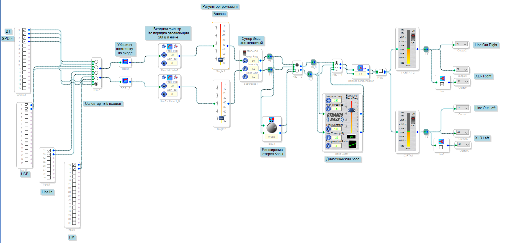
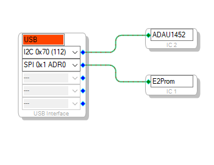
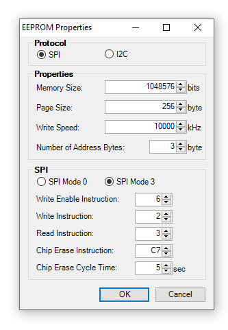
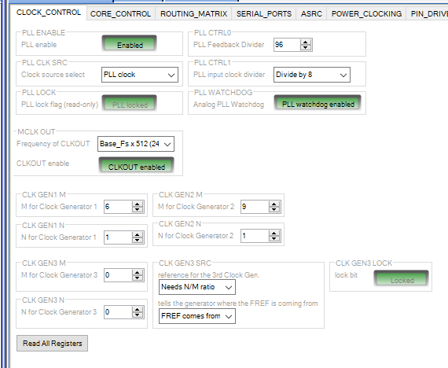
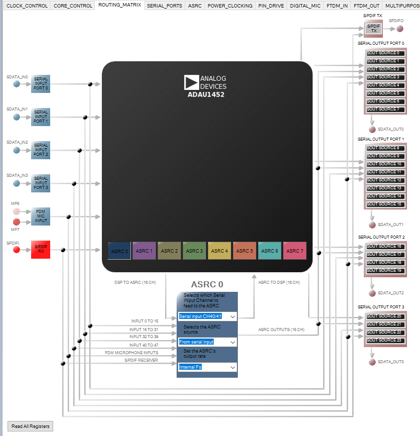
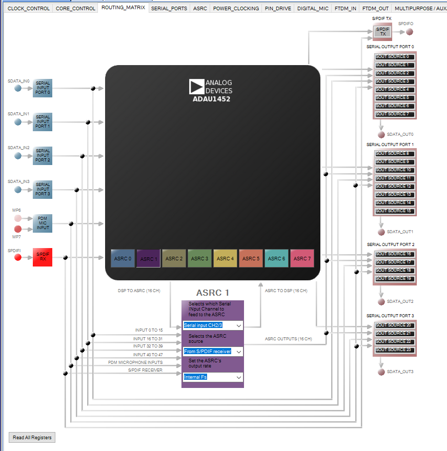
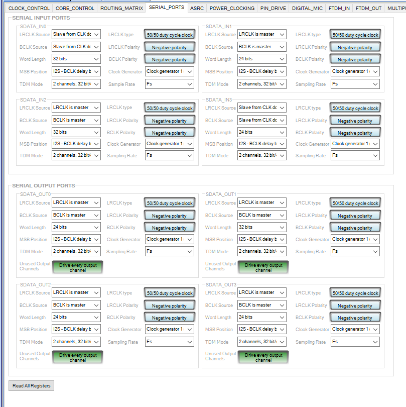
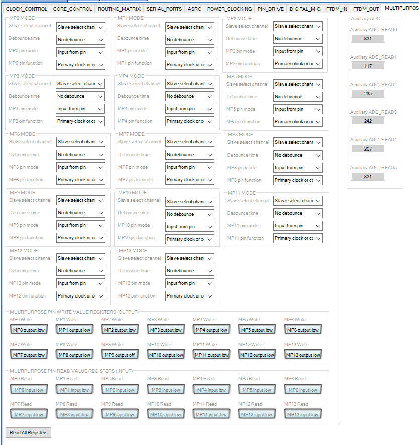

# dsp-adau1452

It uses adau1452 as DSP. Examples of working projects.

1. Make

# Russian

*Примеры проектов на adau1452.*

**Использовались:**
* [RDC3-0027v1, SigmaDSP ADAU1452. Модуль цифровой обработки звука. V1](https://www.chipdip.ru/product/rdc3-0027v1)
* [USB I2S преобразователь 32bit/96kHz, SUPER PRIME chipdip, USB Hi-Res Audio, квадро, STM32F446RC](https://www.chipdip.ru/product0/9000569733)
* [PCM5102A audio DAC, Преобразователь: I2S - Аудио. Разрешение 32 бит, частота дискретизации 384kHz](https://www.chipdip.ru/product/pcm5102a-audio-dac)
* [PCM1808 audio ADC, Преобразователь: Аудио - I2S. Разрешение 24 бит, частота дискретизации 96kHz](https://www.chipdip.ru/product/pcm1808-audio-adc)
* [SigmaLink-USBi, USBi программатор для SigmaStudio](https://www.chipdip.ru/product/sigmalink-usbi)
* [Ванилин, Программируемый контроллер на базе ATmega328P-AU, CP2102 (Arduino Uno)](https://www.chipdip.ru/product/vanilin-2) - 2 шт.
* [RDC2-0015A, Преобразователь уровней напряжения. 4 в 1.](https://www.chipdip.ru/product/rdc2-0015a)
* Энкодер
* Два ёмкосных датчика-кнопки
* Синий светодиод + резитор 220 Ом
* Красный светодиод + резистор 220 Ом
* Фоторезистор + 10кОм резистор, включено: одна нога фоторезистора на +5в, вторая нога фоторезистора соединяется с резистором и подключается к A0 Arduino, вторая нога рещистора подключается к GND.
* LCD экран 16х2 подклюаемый по I2C
* Две платы RF24L01+ с переходниками
* Две простых кнопки для пульта

## 5. Версия с микроконтроллером Arduino и радио пультом на RF24L01.

**Использовались:**
* [RDC3-0027v1, SigmaDSP ADAU1452. Модуль цифровой обработки звука. V1](https://www.chipdip.ru/product/rdc3-0027v1)
* [USB I2S преобразователь 32bit/96kHz, SUPER PRIME chipdip, USB Hi-Res Audio, квадро, STM32F446RC](https://www.chipdip.ru/product0/9000569733)
* [PCM5102A audio DAC, Преобразователь: I2S - Аудио. Разрешение 32 бит, частота дискретизации 384kHz](https://www.chipdip.ru/product/pcm5102a-audio-dac)
* [PCM1808 audio ADC, Преобразователь: Аудио - I2S. Разрешение 24 бит, частота дискретизации 96kHz](https://www.chipdip.ru/product/pcm1808-audio-adc)
* [SigmaLink-USBi, USBi программатор для SigmaStudio](https://www.chipdip.ru/product/sigmalink-usbi)
* [Ванилин, Программируемый контроллер на базе ATmega328P-AU, CP2102 (Arduino Uno)](https://www.chipdip.ru/product/vanilin-2)
* [RDC2-0015A, Преобразователь уровней напряжения. 4 в 1.](https://www.chipdip.ru/product/rdc2-0015a)
* Энкодер
* Два ёмкостных датчика-кнопки
* Синий светодиод + резистор 220 Ом
* Красный светодиод + резистор 220 Ом
* Фоторезистор + 10кОм резистор, включено: одна нога фоторезистора на +5в, вторая нога фоторезистора соединяется с резистором и подключается к A0 Arduino, вторая нога рещистора подключается к GND.
* LCD экран 16х2 подключаемый по I2C
* Две платы RF24L01+ с переходниками
* Две простых кнопки для пульта

Входы: USB через SUPER PRIME, китайский bluetooth 5.0 модуль подключенный через I2S к ADAU1452, линейный вход, подключенный через PCM1808 к ADAU1452, SPDIF оптика через RX147, FM в проекте.
Выходы: один PCM5102A стерео, два PCM5102A для XLR стерео выхода, дополнительно к каждому PCM5102A в месте подключения +5в и GND подключены конденсаторы 100мкФ и 0.1мкФ, иначе слышимые помехи, при включении лишь одного DAC ничего не нужно.

У входа стоят фильтры от постоянки на входе и фильтры высоких частот от 20Гц, чтобы обрезать всё что ниже.
Управления:
1 кнопка вкл/выкл - система засыпает
2 кнопка выбора каналов: последовательно BT -> USB -> LineIn -> FM -> SPDIF
3 Энкодер: клик - выбор параметра для регулировки, вращение - смена регулировки.
  Параметры:
  * громкость
  * баланс
  * включение супер бас
  * включение динамический бас
  * включение расширения стерео-базы
После простоя работы с меню - переключение на громкость.

Для Arduino для проекта:
 * В папке adau1452-arduino: базовая часть для управления DSP, дополнительно подключаем RF24L01 к 9 (CE), 10 (CSN), 11 (MO), 12 (MI), 13 (SCK) выводам Arduino Nano/Uno
 * В папке TX - скетч пульта-передатчика, подключаем RF24L01 к 9 (CE), 10 (CSN), 11 (MO), 12 (MI), 13 (SCK) выводам Arduino Nano/Uno, энкодер к выводам 2(CLK), 3(DT), 8(SW), кнопку переключения каналов к выводам: GND, 4; кнопку выкл/вкл к выводам: GND, 5.

#При загрузке скетча в Arduino могут быть ошибки из-за того, что RF24L01 сидит на SPI пинах, если есть ошибки - на вермя загрузки отключить модуль RF24L01.

**Основная схема**

**Подключение блоков**

**Настройка DSP EEPROM**

**Вкладка настройки CLOCK CONTROL**

**Вкладка настройки asrc0**

**Вкладка настройки asrc1**

**Вкладка настройки SERIAL PORT**

**Вкладка настройки для настройка портов**

